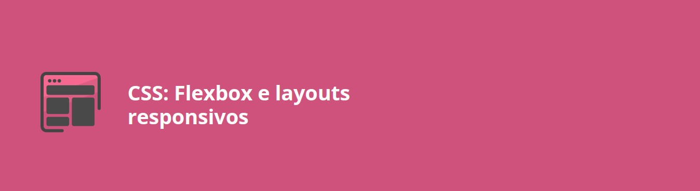

<h1 align="center">

</h1>

## Descrição

Neste curso, foi apresentado como criar layouts modernos e responsivos utilizando as propriedades do Flexbox. Durante as aulas, exploramos como organizar elementos de forma eficiente, adaptando-os para diferentes dispositivos, como celulares, tablets e desktops. O curso aborda boas práticas de desenvolvimento web e a integração de Flexbox com outras propriedades CSS.

[Pasta do projeto](./projeto-aluraplay-projeto-base/)

---

## Estrutura do Curso

1. **Introdução ao Flexbox:**

   - Conheça as características e vantagens do Flexbox.
   - Compreenda como ele facilita a criação de layouts responsivos.

2. **Propriedades do Flexbox:**

   - Altere o eixo de itens para horizontal ou vertical.
   - Ajuste espaçamento, alinhamento e distribuição de elementos.

3. **Flexbox na Prática:**

   - Aplique Flexbox em vídeos responsivos.
   - Integre Flexbox com outras propriedades CSS para criar designs completos.

4. **Adaptação para Diferentes Dispositivos:**

   - Utilize Flexbox para ajustar o layout para celulares, tablets e desktops.
   - Garanta uma experiência consistente e moderna para o usuário.

---

## Descrição do Projeto

### Projeto: **AluraPlay**

#### Objetivo Final

Criar uma plataforma de vídeos responsiva e moderna, utilizando Flexbox para organizar elementos e ajustar o layout para diferentes tamanhos de tela. O foco principal é a usabilidade e a experiência do usuário em celulares, tablets e desktops.

####

