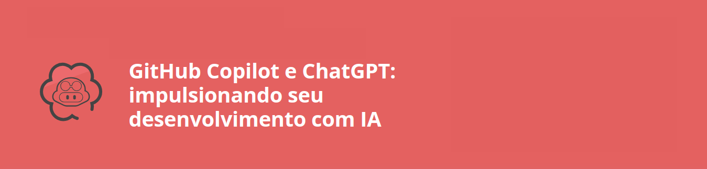

<h1 align="center">

</h1>

## Descrição

Neste curso, foi desenvolvido o projeto de um **Jogo de Pong Espacial**, uma versão de um projeto já existente o Pong, mas utilizando o **GitHub Copilot** como ferramenta principal para auxiliar no desenvolvimento. O objetivo foi entender como integrar tecnologias de Inteligência Artificial ao processo de codificação, simulando uma colaboração com um colega de equipe.

Para conferir a minha versão deste projeto, desenvolvida com o auxílio do ChatGPT, visite o [repositório do projeto](../ChatGPT%20e%20JavaScript:%20construa%20o%20jogo%20Pong/).

[Pasta do projeto](./github-copilot-pong/)

---

## Funcionalidades do Jogo

- **Jogadores controlados por classes**: Criamos classes para gerenciar as hastes dos jogadores e a bola.
- **Colisões dinâmicas**: Implementamos a detecção de colisões entre a bola e as hastes.
- **Melhorias visuais**: Adicionamos imagens temáticas ao cenário para torná-lo mais atrativo.
- **Efeitos sonoros**: Integramos sons ao jogo, tornando-o mais imersivo e dinâmico.

---

## Temas abordados

Durante o curso, os seguintes temas foram apresentados e aplicados:

- Instalação e configuração da extensão **GitHub Copilot Labs** no VS Code.
- Criação de classes em JavaScript para organizar o código de forma modular.
- Detecção e manipulação de colisões na mecânica do jogo.
- Personalização do cenário com imagens temáticas.
- Utilização de sons para eventos específicos do jogo, como colisões e pontuações.

---

## Tecnologias Utilizadas

- **JavaScript** (ES6+)
- **GitHub Copilot** para autocompletar e sugerir códigos
- **HTML5** e **CSS3** para estrutura e estilização
- **Elementos de áudio e imagens** para enriquecer o visual e sonoro do jogo

---

