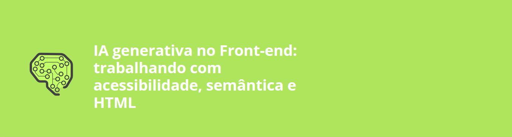

<h1 align="center">

</h1>

## Descrição

Neste curso, utilizamos ferramentas de IA para melhorar a semântica e acessibilidade em códigos HTML. Durante as aulas, foi abordado como analisar e refatorar códigos de forma eficiente, com foco em boas práticas de desenvolvimento.Também foi apresentado ferramentas como o Lighthouse, além de realizar análises e revisões críticas para propor soluções otimizadas.

Ao longo do curso, colocamos em pratica os conceitos para evoluir as habilidades em HTML, CSS e acessibilidade, ao longo do projeto foi enfrentado desafios que simulam problemas reais encontrados no dia a dia do desenvolvimento.

[Pasta do projeto](./jornada-ia-base-projeto-base/)

---

## Estrutura do Curso

1. **Análise de HTML e Tags Semânticas:**
   - Como identificar e corrigir problemas de semântica em códigos HTML.
   - Diferenças entre semântica e sintaxe.

2. **Refatoração Efetiva com IA:**
   - Utilização de IA para refatorar elementos como banners e seções complexas.
   - Críticas e sugestões geradas automaticamente para melhorar o código.

3. **Utilização de Ferramentas de Avaliação:**
   - Como usar o Lighthouse para identificar melhorias e problemas.
   - Melhoria do desempenho, acessibilidade e boas práticas através de relatórios detalhados.

4. **Evolução de Projetos com HTML Semântico:**
   - Proposição de soluções em diferentes cenários de implementação.
   - Criação de projetos do zero que integram técnicas de semântica e IA.

---

## Descrição do Projeto
O projeto visa desenvolver um site de viagens que não apenas exiba ofertas de destinos, como Japão, San Andreas, Paraíba e Manaus, mas que também priorize a acessibilidade e a semântica no código HTML. Através da implementação de boas práticas de desenvolvimento, como o uso de tags semânticas e a organização do conteúdo, o site se tornará mais fácil de navegar e entender, tanto para os usuários quanto para os motores de busca.

O objetivo é garantir que todas as informações sejam apresentadas de forma clara e intuitiva, permitindo que todos os visitantes, incluindo aqueles com deficiências, possam acessar e aproveitar as ofertas de viagens disponíveis. Além disso, ao melhorar a semântica do código, o site terá um melhor desempenho em termos de SEO (otimização para motores de busca), aumentando sua visibilidade e alcance.

