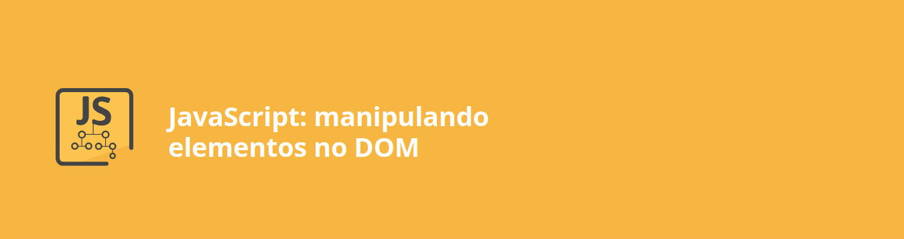

<h1 align="center">

</h1>

## Descrição

Neste curso, foi apresentada a manipulação de elementos HTML através do DOM (Document Object Model), utilizando JavaScript para criar páginas dinâmicas e interativas. Durante as aulas, aplicamos técnicas de alteração de estilos CSS, atributos e classes, além de eventos que respondem à interação dos usuários.

A prática foi focada no desenvolvimento de uma aplicação do zero, abordando desde conceitos básicos até a utilização de objetos utilitários do JavaScript, garantindo que o aprendizado fosse consolidado de forma prática e eficiente.

[Pasta do projeto](./Fokus-projeto-base/)

---

## Estrutura do Curso

1. **Construção de um Temporizador Estilo Pomodoro:**
   - Desenvolvimento completo do temporizador Fokus, inspirado na técnica Pomodoro.
   - Organização e planejamento do projeto do zero.

2. **Manipulação de Elementos no DOM:**
   - Alteração dinâmica de estilos CSS, imagens e textos.
   - Modificação de atributos e classes para criar experiências personalizadas.

3. **Eventos de Interação com Usuários:**
   - Implementação de eventos de clique, alteração visual de botões e ativação de áudios.
   - Criação de uma interface responsiva e interativa.

4. **Utilização de Objetos Utilitários do JavaScript:**
   - Aplicação de objetos e métodos para otimizar funcionalidades.
   - Abordagem prática para problemas comuns no desenvolvimento front-end.

---

## Descrição do Projeto

### Projeto: **Fokus**

#### Objetivo Final
O projeto Fokus tem como objetivo ajudar os usuários a otimizar sua produtividade com a técnica Pomodoro. A aplicação permite que os usuários concentrem-se em tarefas importantes por 25 minutos, seguidos de pausas curtas ou longas, utilizando recursos visuais e sonoros para orientá-los.

#### O que Foi Desenvolvido
- Um cronômetro funcional que alterna entre períodos de foco e descanso.
- Alterações visuais dinâmicas, como mudanças de estilo em botões e textos motivacionais.
- Ativação de áudios para indicar início e término dos períodos de foco e descanso.
- Integração de eventos de clique e manipulação do DOM para criar uma experiência fluida e interativa.

Este projeto foi fundamental para consolidar o aprendizado de manipulação de DOM com JavaScript e para desenvolver habilidades práticas essenciais para o desenvolvimento front-end.

