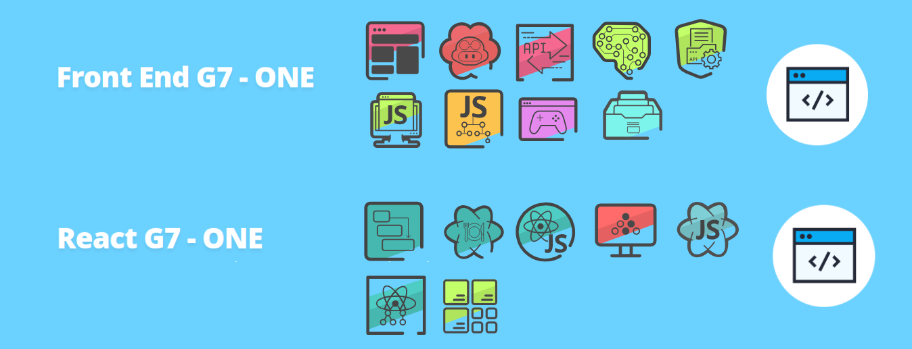

<h1 align="center">

</h1>

## Descrição
Este repositório é destinado a armazenar meus projetos da etapa especialização Front end.

Para conferir o repositório **Iniciante em programação** [clique aqui.](https://github.com/SergioSinhoca/iniciante-programacao-next-education/tree/main) 

 > ℹ️ **Aviso:** Repositório em construção. Pode haver links ou funcionalidades que não estejam funcionando. Não se preocupe, ele está em construção e em breve estará disponível: 

**Front End G7 - ONE**
- IA generativa no Front-end: trabalhando com acessibilidade, semântica e HTML
- CSS: Flexbox e layouts responsivos
- JavaScript para Web: Crie páginas dinâmicas
- JavaScript: manipulando elementos no DOM
- ChatGPT e JavaScript: construa o jogo Pong
- JavaScript: consumindo e tratando dados de uma API
- JavaScript: criando requisições
- GitHub Copilot e ChatGPT: impulsionando seu desenvolvimento com IA

**Desafios**
- Praticando Front End: Challenge Portfólio
- Praticando Front End: Challenge AluraGeek (Tatical Store)

**React G7 - ONE**
- React: desenvolvendo com JavaScript
- React: como os componentes funcionam
- React: desenvolvendo em React Router com JavaScript
- React: estilize componentes com Styled Components e manipule arquivos estáticos
- React: gerencie estados globalmente com Context API
- React: praticando React com Js

**Desafios**
- Praticando React: Challenge AluraFlix

## Atalhos
Links diretos para acessar os repositórios

- [Front End G7 - ONE]() 
- [React G7 - ONE]() 

## Links Úteis
Este curso faz parte do programa `Oracle Next Education` em parceria com a `Alura`. Para saber mais sobre o programa, acesse o link abaixo:

- [Oracle Next Education](https://www.oracle.com/br/education/oracle-next-education/)

 > ℹ️ **NOTE:** Os SVGs utilizadas nos README foram retiradas do site da Alura. Todos os direitos são reservados à **Alura**. Para saber mais, acesse o link abaixo: 

- [Alura](https://www.alura.com.br/)

